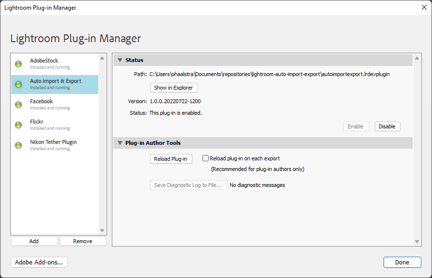
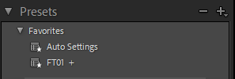
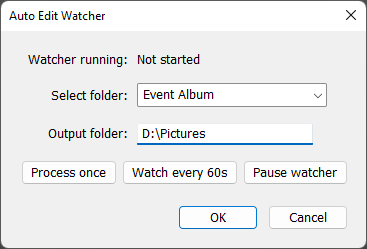

# Auto Import Export

_Auto import export for Lightroom which applies all favorite presets_

Easily edit flagged photos with a set of presets, convenient for events where you continuously want to output your pictures.

## Installation

1. Clone this repository or download the folder to your disk.
2. Add the plugin by adding the folder in Lightroom via `File > Plug-in Manager` or press `Ctrl+Alt+Shift+,`
   

## Usage

1. Prepare your presets in the favorites folder. For convenience you can create a preset that first applies `Auto Settings` and then another preset to create the look and feel you want to have. For example you can set it up like this:

   

2. Flag all photos you want to apply the filter to and export as `Flagged`.

3. Open the `Auto Import Export` window by navigating to `File > Plug-in Extras > Auto Import Export`.

   

4. Specify which folder you want to apply the script to, and specify the output folder (full path).

5. Now you have two options (A) apply the process just once by pressing `Process once` or (B) start a watcher that will run the script every 60 seconds (_currently works on Windows only_).

6. This will process all pictures by:

   - Applying the presets in the favorite folder (top to bottom) that have the flag `Flagged`
   - Rating the picture with 3 stars to keep track which pictures do not need to be processed again
   - Exporting full quality JPEG to the specified folder

7. Press pause watcher if you want to stop the watcher. If you want to run the script in the background press `OK` or `Cancel`. _Note: that it will keep on running as long as Lightroom is open (a more neat solution is yet to be found)._

8. Enjoy your edited photos without lifting a single finger!

## Improvements

If you have any suggestions for improvements feel free to open a pull request or creating an issue.

**Whishlist**

- Change functionality of `OK` and `Cancel` buttons to run the script in the background or stop it.
